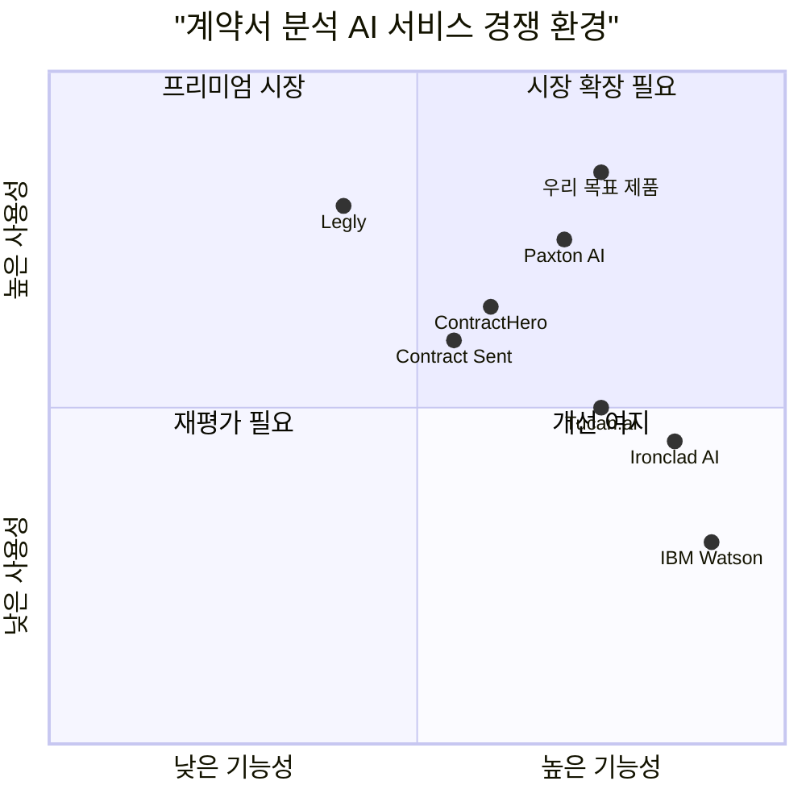

# 계약서 분석 AI 서비스 PRD (Product Requirements Document)

## 1. 언어 및 프로젝트 정보

**언어**: 한국어  
**프로그래밍 언어**: TypeScript, React, Shadcn-ui, Tailwind CSS  
**프로젝트명**: contract_analysis_ai  
**원본 요구사항**: 계약서 분석 AI 서비스의 웹페이지 개발을 위한 프론트엔드 기능 구현

## 2. 제품 정의

### 2.1 제품 목표

1. **효율적인 계약서 분석**: AI 기반 자동 분석을 통해 계약서 검토 시간을 90% 단축
2. **위험 요소 조기 발견**: 잠재적 법적 위험과 비표준 조항을 자동으로 식별하여 비즈니스 리스크 최소화
3. **직관적인 사용자 경험**: 법률 전문가가 아닌 일반 사용자도 쉽게 사용할 수 있는 인터페이스 제공

### 2.2 사용자 스토리

1. **As a** 중소기업 대표, **I want** 복잡한 계약서를 빠르게 분석하고 위험 요소를 파악하고 싶다 **so that** 법률 자문 비용을 절약하면서도 안전한 계약을 체결할 수 있다.

2. **As a** 법무팀 담당자, **I want** 여러 계약서를 일괄적으로 분석하고 비교하고 싶다 **so that** 표준화된 검토 프로세스를 구축하고 업무 효율성을 높일 수 있다.

3. **As a** 스타트업 창업자, **I want** 투자 계약서나 파트너십 계약서의 조건을 쉽게 이해하고 싶다 **so that** 불리한 조건 없이 현명한 비즈니스 결정을 내릴 수 있다.

4. **As a** 프리랜서, **I want** 클라이언트와의 계약서에서 주의해야 할 조항들을 확인하고 싶다 **so that** 분쟁 가능성을 미리 방지하고 안정적인 업무 관계를 유지할 수 있다.

5. **As a** 구매팀 매니저, **I want** 공급업체와의 계약서를 표준 템플릿과 비교 분석하고 싶다 **so that** 회사 정책에 부합하는 계약 조건을 확보할 수 있다.

### 2.3 경쟁사 분석

#### 주요 경쟁사 현황

1. **Ironclad AI**
   - **장점**: 강력한 AI 분석 엔진, 엔터프라이즈급 보안, 워크플로우 자동화
   - **단점**: 높은 가격대, 복잡한 설정 과정, 중소기업에게는 과도한 기능

2. **Paxton AI**
   - **장점**: 자연어 질의응답 기능, 직관적인 UI, 빠른 분석 속도
   - **단점**: 제한적인 파일 형식 지원, 한국어 지원 부족

3. **ContractHero**
   - **장점**: 우수한 OCR 기능, 다양한 언어 지원, 합리적인 가격
   - **단점**: AI 분석 정확도 한계, 제한적인 커스터마이징 옵션

4. **Tucan.ai**
   - **장점**: 프로젝트 단위 관리, 협업 기능, 상세한 분석 리포트
   - **단점**: 느린 처리 속도, 복잡한 사용자 인터페이스

5. **IBM Watson Compare and Comply**
   - **장점**: 높은 분석 정확도, 강력한 API, 엔터프라이즈 신뢰성
   - **단점**: 매우 높은 비용, 기술적 복잡성, 설정의 어려움

6. **Legly**
   - **장점**: 간단한 사용법, 빠른 시작, 모바일 친화적
   - **단점**: 기본적인 분석 기능만 제공, 고급 기능 부족

7. **Contract Sent**
   - **장점**: 계약서 비교 기능 특화, 변경 이력 추적, 협업 도구
   - **단점**: AI 분석 기능 제한적, 단독 사용 시 기능 부족

### 2.4 경쟁사 포지셔닝 차트

## 3. 기술 요구사항 분석

### 3.1 요구사항 개요

계약서 분석 AI 서비스는 사용자가 다양한 형태의 계약서를 업로드하고, AI를 통해 자동으로 분석하여 위험 요소를 식별하고, 결과를 직관적으로 제공하는 웹 기반 플랫폼입니다. 법률 전문가가 아닌 일반 사용자도 쉽게 사용할 수 있도록 설계되어야 하며, 동시에 전문가들이 필요로 하는 고급 기능도 제공해야 합니다.

### 3.2 요구사항 풀

#### P0 (필수 요구사항)

1. **파일 업로드 시스템**
   - 드래그 앤 드롭 인터페이스 구현
   - PDF, Word, 이미지 파일 형식 지원
   - 파일 크기 제한 및 유효성 검사
   - 업로드 진행률 표시

2. **AI 분석 엔진 연동**
   - 분석 시작 버튼 및 진행 상황 UI
   - 실시간 분석 상태 업데이트
   - 분석 완료 알림 시스템

3. **위험 조항 표시 기능**
   - 위험도별 색상 코딩 (높음/중간/낮음)
   - 조항별 상세 설명 팝업
   - 원문 내 해당 위치 하이라이트

4. **기본 분석 결과 표시**
   - 분석 결과 요약 대시보드
   - 주요 위험 요소 목록
   - 권장 사항 제시

5. **사용자 인증 및 보안**
   - 로그인/회원가입 시스템
   - 문서 암호화 저장
   - 세션 관리

#### P1 (중요 요구사항)

1. **OCR 기능**
   - 스캔된 이미지 계약서 텍스트 추출
   - 다국어 OCR 지원
   - 텍스트 정확도 검증

2. **분석 결과 비교 기능**
   - 나란히 비교 뷰
   - 차이점 하이라이트
   - 변경 이력 추적

3. **AI 채팅 인터페이스**
   - 계약서 관련 질의응답
   - 자연어 처리 기반 대화
   - 컨텍스트 유지 대화

4. **결과 저장 및 관리**
   - 분석 이력 저장
   - 프로젝트별 분류
   - 검색 및 필터링

5. **분석 파라미터 설정**
   - 분석 깊이 조절
   - 특정 조항 집중 분석
   - 사용자 정의 위험 기준

#### P2 (선택 요구사항)

1. **배치 분석 기능**
   - 다중 파일 일괄 업로드
   - 대량 처리 상태 모니터링
   - 배치 결과 통합 리포트

2. **고급 시각화**
   - 위험도 차트 및 그래프
   - 조항별 통계 분석
   - 트렌드 분석 대시보드

3. **협업 기능**
   - 팀 멤버 초대 및 권한 관리
   - 댓글 및 메모 기능
   - 승인 워크플로우

4. **API 연동**
   - 외부 시스템 연동 API
   - 웹훅 지원
   - 써드파티 통합

5. **모바일 최적화**
   - 반응형 웹 디자인
   - 모바일 전용 기능
   - 오프라인 지원

### 3.3 UI 설계 초안

#### 메인 대시보드
- 상단: 네비게이션 바 (로고, 메뉴, 사용자 프로필)
- 중앙: 파일 업로드 영역 (드래그 앤 드롭 존)
- 하단: 최근 분석 결과 카드 목록

#### 분석 결과 페이지
- 좌측: 원문 계약서 뷰어 (하이라이트 적용)
- 우측: 분석 결과 패널
  - 위험도 요약
  - 위험 조항 목록
  - 권장 사항
- 하단: AI 채팅 인터페이스

#### 비교 분석 페이지
- 분할 화면: 좌측(기존), 우측(신규)
- 상단: 비교 옵션 및 필터
- 중앙: 차이점 하이라이트 표시
- 하단: 변경 사항 요약

### 3.4 미해결 질문

1. **AI 모델 선택**: 어떤 AI 모델을 사용할 것인가? (GPT-4, Claude, 자체 모델)
2. **처리 용량**: 동시 처리 가능한 최대 사용자 수는?
3. **데이터 보관**: 분석된 계약서 데이터의 보관 기간은?
4. **국제화**: 초기 버전에서 다국어 지원 범위는?
5. **가격 정책**: 사용량 기반 vs 구독 기반 요금제?
6. **규제 준수**: GDPR, 개인정보보호법 등 법적 요구사항 대응 방안은?
7. **성능 목표**: 분석 완료까지의 목표 시간은?
8. **백업 및 복구**: 시스템 장애 시 데이터 복구 전략은?

---

*이 PRD는 계약서 분석 AI 서비스의 초기 버전 개발을 위한 기본 요구사항을 정의합니다. 개발 과정에서 사용자 피드백과 시장 변화에 따라 지속적으로 업데이트될 예정입니다.*